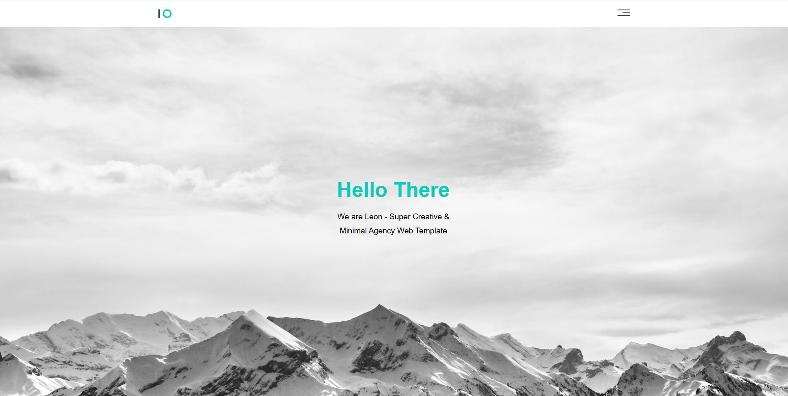
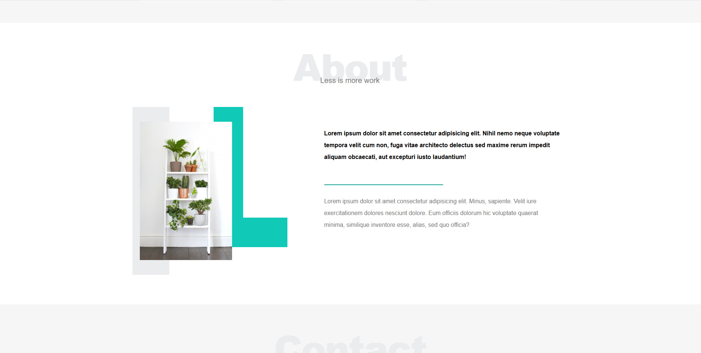
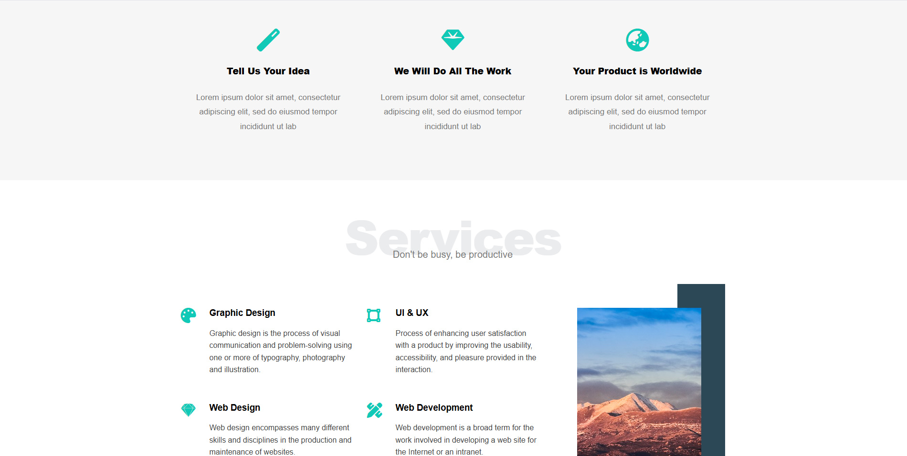
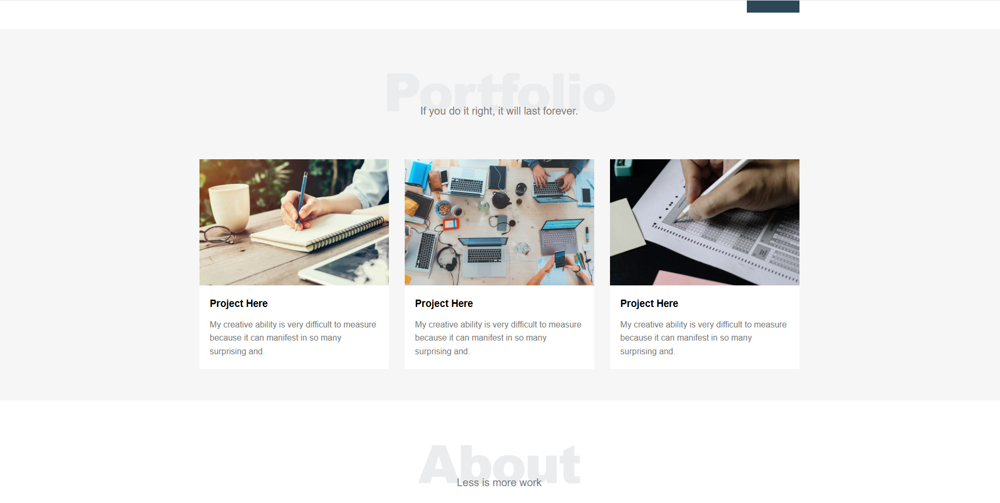
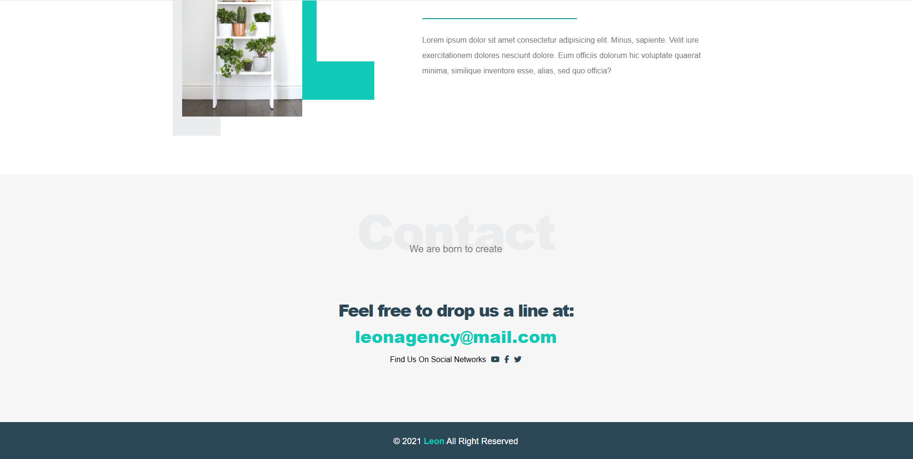
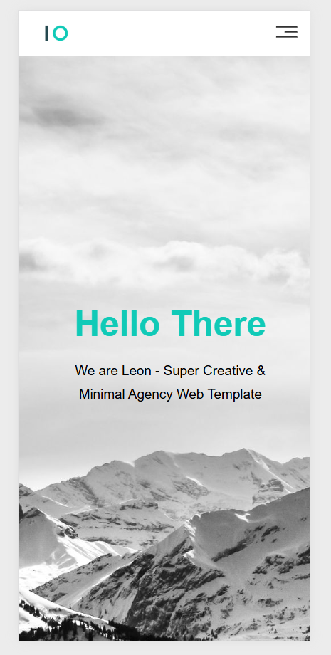

# 🌟 Responsive Leon Template (HTML5 & CSS3)



> A clean and minimalist responsive website template built with HTML5 and CSS3, perfect for personal portfolios, agencies, or businesses.

---

## 🔗 Live Demo

[View the Leon Template Demo](https://youssefadel170.github.io/Leon-Template/)

---

## 📌 Project Overview

**Leon Template** is a modern, fully responsive HTML5 & CSS3 template designed to elegantly showcase services, portfolio items, and personal or business information.  
It is ideal for anyone looking for a **clean, professional, and visually appealing website**.

---

## ✨ Features

- **Header** – Logo and smooth navigation menu.
- **Landing Section** – Engaging introduction with call-to-action button.
- **Services** – Highlight core offerings with icons and descriptions.
- **Portfolio** – Showcase recent projects with images and details.
- **About** – Information about the person or company, mission, and values.
- **Contact** – Contact form including name, email, message, phone, and address.
- **Footer** – Social media links, copyright, and additional details.

---

## 🖼️ Screenshots / Preview

### Desktop

| Home                          | About                           | Services                              |
| ----------------------------- | ------------------------------- | ------------------------------------- |
|  |  |  |

| Portfolio                               | Contact                                    | Footer                                    |
| --------------------------------------- | ------------------------------------------ | ----------------------------------------- |
|  |  |  |

### Mobile

| Mobile View                       |
| --------------------------------- |
|  |

> Screenshots showcase the responsiveness and clean design across devices.

---

## 🛠️ Technologies Used

- **HTML5** – Semantic and structured markup.
- **CSS3** – Styling, layout, and responsive design.
- **Responsive Design** – Fully optimized for **desktop, tablet, and mobile devices**.

---

## 🚀 Getting Started

1. **Clone the repository**
   ```bash
   git clone https://github.com/YoussefAdel170/Leon-Template.git
   ```
2. **Navigate into the project directory**
   ```bash
   cd Leon-Template
   ```
3. Open **index.html** in your browser.
